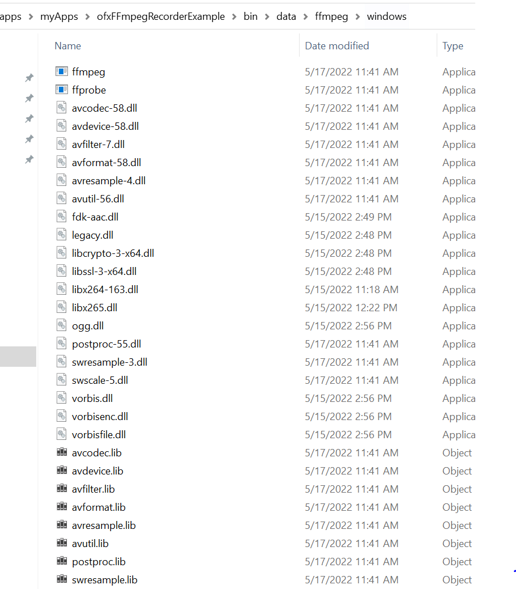

# Manula compilation FFmpeg on Windows 10.

<br>

This guide is up to date with `FFmpeg` version `5.0` and `cuda` version `11.5`, for `Windows 10`, and writen in the spring 2022.

<br>

Those steps might change in the future - Nvidia Gpu Toolkit or flags to configure FFmpeg -.

# Install msys2 and mingw64


<br>

Download msys2 from [here](https://www.msys2.org/).

<br>

Follow the first 7 steps on the msys2 download page to set up msys2 and update the packages.

<br>

Make sure to install msys2 at `C:\dev\msys64` as this is the path referred to to launch it.

<br>

# VCPKG

<br>

Use [vcpkg](https://vcpkg.io/en/index.html) to install seperate libraries:

<br>
<br>

Open `x64 Native Tools Command Prompt for VS 2017` (or `2019` or `2022` depending on your installation, they are interchangeable):

<br>

Create the folder which you will be using to install FFmpeg and its dependencies:

```sh
cd /
mkdir FFmpegInstall && cd FFmpegInstall && mkdir ffmpeg_build

git clone https://github.com/Microsoft/vcpkg

cd vcpkg

bootstrap-vcpkg.bat

```


<br>

## Libraries to install with vcpkg:

<br>

* [x264](https://github.com/mirror/x264)
* [x265](https://github.com/videolan/x265)
* [openssl](https://www.openssl.org/)
* [fdk-aac](https://github.com/mstorsjo/fdk-aac)
* [libvorbos](https://xiph.org/vorbis/)
* [libmp3lame](https://lame.sourceforge.io/)

<br>

To do so simply use the following command :


```sh

vcpkg --triplet=x64-windows-release install x264 --debug
vcpkg --triplet=x64-windows-release install x265 --debug
vcpkg --triplet=x64-windows-release install openssl --debug
vcpkg --triplet=x64-windows-release install fdk-aac --debug
vcpkg --triplet=x64-windows-release install libvorbis  --debug
vcpkg --triplet=x64-windows-release install mp3lame  --debug

```


You will find the `.dll`s files at `C:\dev\msys64\FFmpegInstall\vcpkg\installed\x64-windows-release\bin`.

<br>

You will find the `.lib`s files at `C:\dev\msys64\FFmpegInstall\vcpkg\installed\x64-windows-release\lib`.

<br>

You will find the include folder for the libraries at `C:\dev\msys64\FFmpegInstall\vcpkg\installed\x64-windows-release\include`.

<br>
<br>

# FFMPEG with NVIDIA GPU Computing Toolkit

<br>

1) Download Nvidia Cuda Toolkit from [here](https://developer.nvidia.com/cuda-downloads).

<br>

2) Download Nvidia GPU Computing Toolkit from [here](https://developer.nvidia.com/nvidia-video-codec-sdk).

<br>

3) Follow [this guide](https://docs.nvidia.com/video-technologies/video-codec-sdk/ffmpeg-with-nvidia-gpu/#compiling-for-windows) for the `nv headers` :

<br>

Open `x64 Native Tools Command Prompt for VS 2017`

```sh
cd C:\dev\msys64
msys2_shell.cmd -mingw64 -use-full-path
```

<br>

In `mingw64` :

```sh
cd /FFmpegInstall/
mkdir nv_sdk && mkdir nv_sdk/include && mkdir nv_sdk/lib
git clone https://git.videolan.org/git/ffmpeg/nv-codec-headers.git
cd nv-codec-headers/
make 
make install
# dependencies
pacman -S diffutils make pkg-config yasm
# move all link
mv /usr/bin/link.exe /usr/bin/link.exe.bak
mv /bin/link.exe /bin/link.exe.bak
#then 
which link
#gives me
/c/Program Files (x86)/Microsoft Visual Studio/2019/Enterprise/VC/Tools/MSVC/14.29.30037/bin/Hostx64/x64/link
```

<br>

4) Copy content of the folders:
`C:\Program Files\NVIDIA GPU Computing Toolkit\CUDA\v11.5\include` to `C:\dev\msys64\FFmpegInstall\ffmpeg\nv_sdk\include`
and
`C:\Program Files\NVIDIA GPU Computing Toolkit\CUDA\v11.5\lib\x64` to `C:\dev\msys64\FFmpegInstall\ffmpeg\nv_sdk\lib`

<br>

5) Copy the `.pc` file into your `pkg_config_path` :

<br>

Check you pkg_config_path :
Open `x64 Native Tools Command Prompt for VS 2017` (or 2019 or 2022):

```sh
cd C:\dev\msys64
msys2_shell.cmd -mingw64 -use-full-path
```

In the msys2 shell :

```sh
echo $PKG_CONFIG_PATH
#gives me :
/mingw64/lib/pkgconfig:/mingw64/share/pkgconfig
```

Copy the `.pc` file called `ffnvcodec.pc` from the `nv-codec-headers` folder into one of the folder of your path:

<br>

In the msys2 shell :

```sh
cp /FFmpegInstall/ffmpeg/nv-codec-headers/ffnvcodec.pc /mingw64/lib/pkgconfig/
```

<br>

## Get your graphic card architecture

<br>

Check that the installation of cuda has been successful, and check the capabilities of your graphic card (as detailed [here](https://docs.nvidia.com/cuda/cuda-installation-guide-microsoft-windows/#verify-installation) ):

<br>

Open the `x64 Native Tools Command Prompt for VS 2017` and go to your CUDA install replacing `v11.4` with the version of Cuda you are using:

<br>

```sh
cd C:\Program Files\NVIDIA GPU Computing Toolkit\CUDA\v11.4\extras\demo_suite>
.\deviceQuery.exe
```

This will give you the capabilities of the GPU code Generation (`6.0` will correspond to `compute_60` or below `compute_50` etc...):

<br>

```sh
[...]
  CUDA Capability Major/Minor version number:    8.6
[...]
```

<br>

Keep your GPU code Generation and add it as a flag to configuration comand below, such as :

<br>

for me: I had a graphic card with `5.2` so the code is `52`; the flag becomes:

<br>

```sh
--nvccflags="-gencode arch=compute_52,code=sm_52 -O2"
```

# FFmpeg 5.0

<br>

Vcpkg requires a slight different configure file.
You can clone FFmpeg and apply the patch, or download FFmpeg and replace the `configure` file.

## cloning and aplying the patch

<br>

Open the `x64 Native Tools Command Prompt for VS 2017`:

<br>

```sh
git clone https://github.com/FFmpeg/FFmpeg
git checkout 390d685
#paste path to your ofxFFmpegRecorder/Assets/ManualCompilation/patches/x264_x255_libVorbis_fdkAac_openSSL.patch
#for me I get :
git apply C:\Users\pierr\Documents\DEV\OF\of_v0.11.2_vs2017_release\addons\ofxFFmpegRecorder\Assets\ManualCompilation\patches\x264_x255_libVorbis_fdkAac_openSSL.patch
cd .. && mv FFmpeg FFmpeg-n5.0
```
<br>

## Download and replace the `configure` file

<br>

Download `FFmpeg 5.0` from [here](https://github.com/FFmpeg/FFmpeg/releases/tag/n5.0).

<br>

Unzip it into `/FFmpegInstall` .
Replace the `configure` file to apply the [patch](./patches/x264_x255_libVorbis_fdkAac_openSSL.patch) to use the seperate libraries for x264, x265, Vorbis, fdk_aac, and openssl:

<br>   

Use this [configure](./patches/configure) file to replace the `configure` file inside `/FFmpegInstall/FFmpeg-n5.0`.


# Configure FFmpeg 

## Flags

<br>
<br>


Use `make clean` only if you have compiled FFmpeg before, to clean the install.

<br>

Be patient as the mingw64 shell is fraily slow, and it can take up to 1min to output anything.

<br>

Make sure to include the correct path to the include folder for `nv_sdk` and `vcpkg` :

<br>

For me:

```sh
#lib folders
nv_sdk -> "/FFmpegInstall/nv_sdk/lib"
vcpkg -> "/FFmpegInstall/vcpkg/installed/x64-windows-release/lib"

#include folders
nv_sdk -> "/FFmpegInstall/nv_sdk/include"
vcpkg -> "/FFmpegInstall/vcpkg/installed/x64-windows-release/include"

```

<br>

## Compilation


Open the `x64 Native Tools Command Prompt for VS 2017`:

```sh
cd C:\dev\msys64
msys2_shell.cmd -mingw64 -use-full-path
```

In the mingw64 shell :

<br>

```sh
cd /FFmpegInstall/FFmpeg-n5.0
make clean
./configure \
--prefix="/FFmpegInstall/ffmpeg_build" \
--target-os=win64 \
--arch=x86_64 \
--extra-ldflags=-libpath:"/FFmpegInstall/nv_sdk/lib" \
--extra-ldflags=-libpath:"/FFmpegInstall/vcpkg/installed/x64-windows-release/lib" \
--extra-cflags=-I"/FFmpegInstall/nv_sdk/include" \
--extra-cflags=-I"/FFmpegInstall/vcpkg/installed/x64-windows-release/include" \
--nvccflags="-gencode arch=compute_52,code=sm_52 -O2" \
--toolchain=msvc \
--enable-cuda-nvcc \
--enable-libnpp \
--enable-shared \
--pkg-config=pkg-config \
--disable-debug \
--enable-dxva2 \
--enable-d3d11va \
--enable-nonfree \
--enable-gpl \
--enable-openssl \
--enable-libx264 \
--enable-libx265 \
--enable-libfdk-aac \
--enable-openssl \
--enable-libvorbis \
--enable-version3 \
--enable-libmp3lame \
--disable-doc \
--logfile=config.log
make -j$(nproc)
make install
```

<br>

## Copying the extra `.dll` files

Make sure to copy the `.dll` created by vcpkg:

<br>

Open the `x64 Native Tools Command Prompt for VS 2017`:

<br>

```sh
cd C:\dev\msys64
msys2_shell.cmd -mingw64 -use-full-path
```

In the mingw64 shell :

<br>

```sh
cp /FFmpegInstall/vcpkg/installed/x64-windows-release/bin/*.dll /FFmpegInstall/ffmpeg_build/bin/
```

## Copy it all into Openframeworks

Copy the content of `/FFmpegInstall/ffmpeg_build/bin/` into your `/data/ffmpeg/window` application folder:




# Distribution of FFmpeg 

<br>

To comply with the [FFmpeg License and Legal Considerations](https://www.ffmpeg.org/legal.html), the version of FFmpeg distributed with this repo is using the following configuration:

```sh
cd /FFmpegInstall/FFmpeg-n5.0
make clean
./configure \
--prefix="/FFmpegInstall/ffmpeg_build" \
--target-os=win64 \
--arch=x86_64 \
--extra-ldflags=-libpath:"/FFmpegInstall/nv_sdk/lib" \
--extra-ldflags=-libpath:"/FFmpegInstall/vcpkg/installed/x64-windows-release/lib" \
--extra-cflags=-I"/FFmpegInstall/nv_sdk/include" \
--extra-cflags=-I"/FFmpegInstall/vcpkg/installed/x64-windows-release/include" \
--nvccflags="-gencode arch=compute_52,code=sm_52 -O2" \
--toolchain=msvc \
--enable-cuda-nvcc \
--enable-libnpp \
--enable-shared \
--pkg-config=pkg-config \
--disable-debug \
--enable-dxva2 \
--enable-d3d11va \
--enable-nonfree \
--enable-gpl \
--enable-openssl \
--enable-libx264 \
--enable-libx265 \
--enable-libfdk-aac \
--enable-openssl \
--enable-libvorbis \
--enable-version3 \
--enable-libmp3lame \
--disable-doc \
--logfile=config.log
make -j$(nproc)
make install

```
